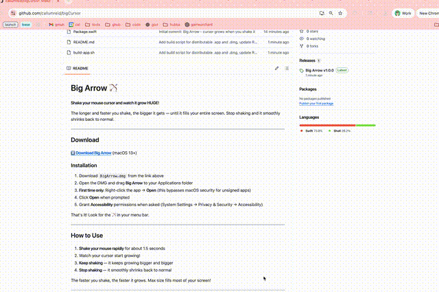

# bigCursor 🖱️



**Shake your mouse cursor and watch it grow HUGE!**

The longer and faster you shake, the bigger it gets — until it fills your entire screen. Stop shaking and it smoothly shrinks back to normal.

---

## Download

**[⬇️ Download bigCursor](../../releases/latest)** (macOS 13+)

### Installation

1. Download `bigCursor.dmg` from the link above
2. Open the DMG and drag **bigCursor** to your Applications folder
3. **Important - bypass Gatekeeper** (unsigned app):
   ```bash
   xattr -cr /Applications/bigCursor.app
   ```
4. Double-click to open, then grant **Accessibility** permissions when asked (System Settings → Privacy & Security → Accessibility)

That's it! Look for the 🖱️ in your menu bar.

> **Note:** If you see "damaged and can't be opened", run the `xattr -cr` command above. The app isn't damaged — macOS blocks unsigned apps downloaded from the internet.

---

## How to Use

1. **Shake your mouse rapidly** for about 1.5 seconds
2. Watch your cursor start growing!
3. **Keep shaking** — it keeps growing bigger and bigger
4. **Stop shaking** — it smoothly shrinks back to normal

The faster you shake, the faster it grows. Max size fills most of your screen!

**Toggle Light/Dark Mode:** Click the 🖱️ menu bar icon to switch between a black cursor (dark mode) and white cursor (light mode).

---

## Quit / Uninstall

- **Quit:** Right-click the 🖱️ menu bar icon → Quit
- **Uninstall:** Drag bigCursor from Applications to Trash

---

## For Developers

### Build from Source

```bash
git clone https://github.com/YOUR_USERNAME/bigCursor.git
cd bigCursor
swift build -c release
.build/release/bigCursor
```

### Create Distributable App

```bash
chmod +x build-app.sh
./build-app.sh
```

This creates:
- `bigCursor.app` — the macOS application
- `bigCursor.dmg` — disk image for easy sharing

---

## Technical Details

- Tracks mouse velocity over a sliding window
- Requires 1.5 seconds of sustained rapid movement before growth begins
- Cursor grows up to 500x normal size
- Works across multiple displays
- Runs as a menu bar app (no Dock icon)
- Click menu bar icon to toggle light/dark mode

## Requirements

- macOS 13.0 (Ventura) or later
- Accessibility permissions (for global mouse tracking)

## License

MIT — do whatever you want with it!
